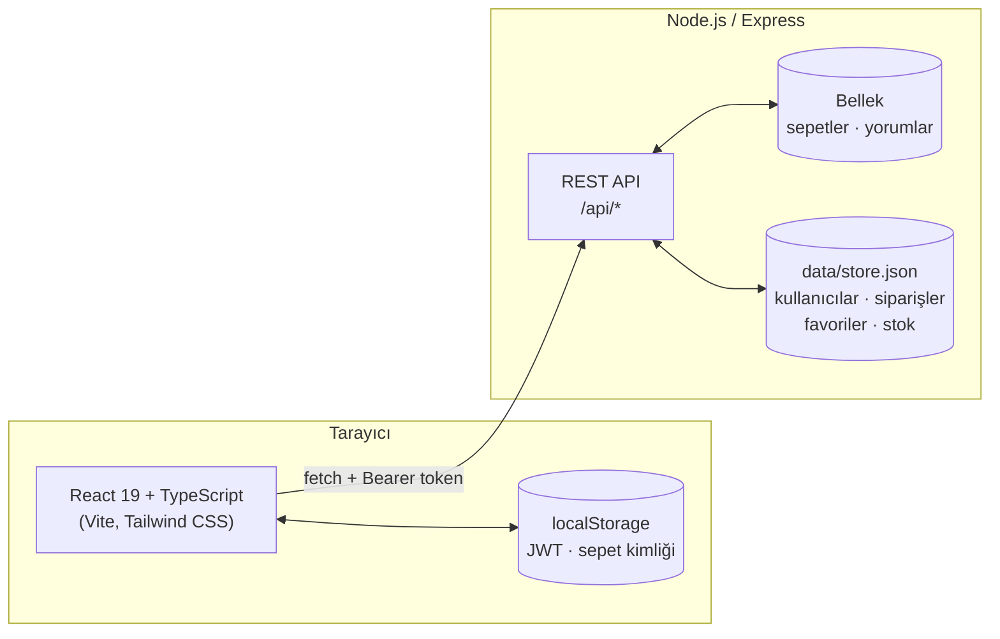

<div align="center">

# Aura Perfumé

**Niş parfüm e-ticaret deneyimi — React + TypeScript arayüzü ve Node.js / Express REST API**


### [🌐 Canlı demo → aura-perfume-7gqz.onrender.com](https://aura-perfume-7gqz.onrender.com)

<sub>Ücretsiz sunucu 15 dk kullanılmazsa uyur; ilk açılış 30–60 sn sürebilir.</sub>

[Özellikler](#-özellikler) · [Mimari](#-mimari) · [Kurulum](#-kurulum) · [Canlıya alma](#%EF%B8%8F-canlıya-alma) · [Demo akışı](#-demo-akışı) · [API](#-api) · [Güvenlik](#-güvenlik-notları)

</div>

---

> [!NOTE]
> Aura Perfumé bir **demo / portföy projesidir**. Gerçek satış yapılmaz; ödeme, kargo ve iade adımları uygulamanın işleyişini göstermek için simüle edilir. Ödeme ekranında gerçek kart bilgisi girmeyin, aşağıdaki [test kartlarını](#test-kartları) kullanın.

Aura Perfumé; ürün kataloğu, kişiselleştirilmiş koku önerileri, üyelik, sepet, 3 adımlı ödeme ve sipariş sonrası süreçleri (takip, iptal, iade) uçtan uca kurgulayan tam yığın (full-stack) bir e-ticaret uygulamasıdır. Arayüzdeki **tüm veriler** projenin kendi REST API'sinden gelir; fiyat, stok ve sipariş tutarı gibi kritik hesaplar yalnızca sunucuda yapılır.

## ✨ Özellikler

| Alan | Neler var? |
|---|---|
| **Katalog** | Sunucu tarafında arama (marka, ad, nota), sıralama ve sayfalama · boyuta göre değişen fiyat · hover'da ikinci ürün görseli |
| **Ürün detayı** | Boyut seçimi, akordeon ürün bilgileri, koku piramidi, puan özetli ve sayfalı müşteri yorumları, benzer ürün önerileri |
| **Koku Testi** | 3 soruluk test; cevaplar sunucuda puanlanıp en uygun parfümler önerilir |
| **Akıllı Koku Bulucu** | Mevsim × kullanım zamanı × koku ailesi filtreleri, anında güncellenen sonuçlar |
| **Üyelik** | Üye ol / giriş yap / çıkış (bcryptjs + JWT); sayfa yenilense ve sunucu yeniden başlasa da korunan oturum |
| **Sepet ve ödeme** | Sunucuda tutulan sepet, stok kontrolü, **üyeli veya misafir** sipariş, 3 adımlı ödeme, 81 il / 973 ilçe listesi, Luhn ile kart doğrulama |
| **Sipariş sonrası** | Siparişlerim, durum zaman çizelgesi, kargo takip numarası, sipariş no + e-posta ile takip, iptal, iade kodu, iade talebini geri alma |
| **İçerik** | Hesaba bağlı favoriler, e-bülten, aramalı SSS, yasal metinler, talep numarası üreten iletişim formu |
| **Arayüz** | Minimal siyah-beyaz tasarım, mobil uyumlu düzen, tarayıcının geri tuşuyla uyumlu tam sayfa görünümler, lazy loading |

## 🧱 Mimari



- **Frontend** arayüzden ve kullanıcı etkileşiminden sorumludur; tüm istekler tek bir istemci katmanında (`src/api.ts`) toplanır.
- **Backend** iş kurallarının tek kaynağıdır: fiyat, stok, sipariş toplamı, durum geçişleri ve iade süresi sunucuda hesaplanır ve doğrulanır.
- **Kalıcılık:** veriler `data/store.json` dosyasına atomik olarak (önce geçici dosyaya yazılıp sonra yeniden adlandırılarak) kaydedilir; yazma sırasında oluşan bir hata dosyayı bozmaz.

## 📁 Proje yapısı

```
perfume-api/
├── server.js                  # Express REST API (tüm uç noktalar ve iş kuralları)
├── API_DOKUMANTASYON.md       # Uç noktaların istek/yanıt örnekleriyle ayrıntılı açıklaması
├── data/                      # Kalıcı veri — otomatik oluşur, git'e eklenmez
│   ├── store.json             #   kullanıcılar, siparişler, favoriler, stok, iletişim mesajları
│   └── jwt-secret             #   JWT imza anahtarı (ilk açılışta rastgele üretilir)
└── perfume-frontend/
    ├── public/images/         # Ürün, hero, banner ve koku testi görselleri
    └── src/
        ├── api.ts             # Backend istemcisi: tüm fetch çağrıları, hata ve 401 yönetimi
        ├── types.ts           # API ile paylaşılan veri tipleri
        ├── useApiQuery.ts     # AbortController destekli veri çekme hook'u
        ├── auth.ts            # Oturum context'i ve token saklama
        ├── favorites.ts       # Hesaba bağlı favoriler context'i
        ├── card.ts            # Kart türü tespiti, biçimlendirme, Luhn doğrulaması
        ├── turkeyLocations.ts # 81 il / 973 ilçe statik verisi
        ├── finderFilters.ts   # Koku Bulucu filtre tanımları
        ├── App.tsx            # Sayfa akışı, sepet, koleksiyon ve ürün detayı
        ├── CheckoutModal.tsx  # 3 adımlı ödeme
        ├── OrdersPage.tsx     # Siparişlerim ve sipariş takibi
        └── ...                # Navbar, HeroSlider, ScentFinder, Reviews, FaqPage, ContactPage…
```

## 🚀 Kurulum

**Gereksinim:** Node.js 20.19 veya üzeri. İki sunucu ayrı terminallerde çalıştırılır.

```bash
# 1) Backend — http://localhost:3000
cd perfume-api
npm install
npm run dev          # kod değişince kendini yeniden başlatır (veya: npm start)

# 2) Frontend — http://localhost:5173
cd perfume-api/perfume-frontend
npm install
npm run dev
```

Tarayıcıda `http://localhost:5173` adresini açın. API kapalıysa arayüzde "API sunucusuna ulaşılamadı" uyarısı görünür.

| Komut (frontend) | Açıklama |
|---|---|
| `npm run dev` | Geliştirme sunucusu |
| `npm run build` | Tip kontrolü + üretim derlemesi (`dist/`) |
| `npm run lint` | ESLint |

## ☁️ Canlıya alma

Canlıda **tek bir Node.js servisi** hem API'yi (`/api/*`) hem de derlenmiş React sitesini (`perfume-frontend/dist`) sunar; bu sayede tek adres yeterlidir ve CORS ayarı gerekmez.

```bash
npm install
npm run build    # frontend bağımlılıklarını kurar ve siteyi derler
npm start        # http://localhost:3000 — site + API
```

Depodaki [`render.yaml`](render.yaml) ile [Render](https://render.com)'da tek adımda kurulabilir: **New + → Blueprint → bu depo**.

| Ortam değişkeni | Açıklama |
|---|---|
| `PORT` | Sunucu portu (platform otomatik verir) |
| `JWT_SECRET` | Oturum imza anahtarı; verilmezse `data/jwt-secret` dosyasında üretilir |
| `DATA_DIR` | Kalıcı veri klasörü (varsayılan: `data/`) |
| `CORS_ORIGIN` | Frontend ayrı bir adreste yayınlanırsa izin verilecek adres(ler), virgülle ayrılmış |
| `VITE_API_URL` | *(derleme sırasında)* API başka bir adresteyse, ör. `https://api.ornek.com/api` |

> [!IMPORTANT]
> Render'ın ücretsiz planında servis 15 dakika kullanılmazsa uyku moduna geçer (ilk açılış ~30–60 sn) ve disk kalıcı değildir: sunucu yeniden başladığında üyeler ve siparişler sıfırlanır, katalog korunur.

## 🎬 Demo akışı

1. Bir parfümün detay sayfasında boyut seçip **Sepete ekleyin**.
2. Sepetten **Ödemeye geç** → e-posta ve adres → kart bilgileri → **Ödemeyi tamamla**. Üye olmadan da sipariş verilebilir.
3. Onay ekranından **Siparişimi takip et**.
4. Üye olarak (sağ üstteki kişi simgesi) verilen siparişlerde **Siparişlerim** sayfasından iptal edin ya da *"Demo: durumu bir adım ilerlet"* ile teslim edildi durumuna getirip **iade kodu** oluşturun.

### Test kartları

| Kart | Numara | Son kullanma | CVC |
|---|---|---|---|
| Visa | `4242 4242 4242 4242` | gelecekte bir tarih, ör. `12/30` | `123` |
| Mastercard | `5555 5555 5555 4444` | `12/30` | `123` |

Kart numarası Luhn algoritmasıyla doğrulanır; rastgele numaralar reddedilir.

## 🔌 API

Tüm uç noktalar `/api` altındadır. Başlıca gruplar:

| Grup | Örnek uç noktalar |
|---|---|
| Katalog | `GET /perfumes?q=&sort=&order=&season=&time=&scentFamily=` · `GET /perfumes/:id` |
| Keşif | `GET /quiz/questions` · `POST /quiz/recommendations` · `GET /perfumes/:id/recommendations` |
| Yorumlar | `GET` / `POST /perfumes/:id/reviews` |
| Sepet | `GET /carts/:cartId` · `POST /carts/:cartId/items` · `PATCH` / `DELETE /carts/:cartId/items/:perfumeId` |
| Üyelik | `POST /auth/register` · `POST /auth/login` · `GET /auth/me` · `POST /auth/logout` |
| Favoriler | `GET /favorites` · `PUT` / `DELETE /favorites/:perfumeId` |
| Siparişler | `POST /orders` · `GET /orders/my-orders` · `GET /orders/track` · `POST /orders/:no/cancel` · `POST /orders/:no/returns` |
| İçerik | `GET /faq` · `GET /legal/:slug` · `POST /contact` · `POST /newsletter` |

İstek/yanıt örnekleri, doğrulama kuralları ve hata kodları için: **[API_DOKUMANTASYON.md](API_DOKUMANTASYON.md)**

## 🔐 Güvenlik notları

- Şifreler **bcryptjs** ile hash'lenir; düz metin hiçbir yerde saklanmaz.
- **JWT** 7 gün geçerlidir ve her token benzersiz bir `jti` taşır; çıkış yapılınca token sunucuda iptal listesine alınır.
- Tam kart numarası ve CVC **sunucuya gönderilmez**; siparişte yalnızca kart türü ve son 4 hane saklanır. Bu alanlar gönderilirse sunucu isteği reddeder.
- Fiyat ve toplam tutar istemciden alınmaz; sepetteki ürünlerin güncel fiyatlarıyla sunucuda hesaplanır.
- Süresi dolmuş veya iptal edilmiş bir oturumla yapılan istek (401) arayüzde yakalanır; oturum temizlenir ve giriş penceresi açılır.
- `data/` klasörü hash'lenmiş şifreleri ve imza anahtarını içerdiği için `.gitignore`'dadır.

## 💾 Veriler

| Nerede | Neler |
|---|---|
| `data/store.json` (kalıcı) | Kullanıcılar, siparişler, favoriler, iptal edilen oturumlar, stok, iletişim mesajları |
| Bellek (sunucu yeniden başlayınca sıfırlanır) | Sepetler, yorumlar, bülten aboneleri |
| `server.js` | Parfüm kataloğu, SSS ve yasal metinler |

Tüm verileri sıfırlamak için API kapalıyken `data/` klasörünü silin.

## 📄 Kaynaklar

- İl/ilçe verisi: [turkey-neighbourhoods](https://github.com/muratgozel/turkey-neighbourhoods) (MIT) paketinden çıkarılmıştır.
- İkonlar: [Lucide](https://lucide.dev) · Yazı tipi: Cormorant Garamond (Google Fonts).
- Ürün adları ve markalar yalnızca demo amacıyla kullanılmıştır; projenin bu markalarla bir bağlantısı yoktur.
